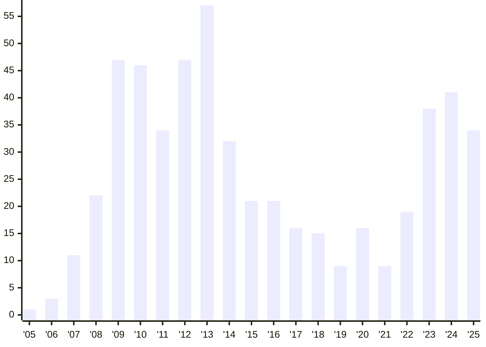
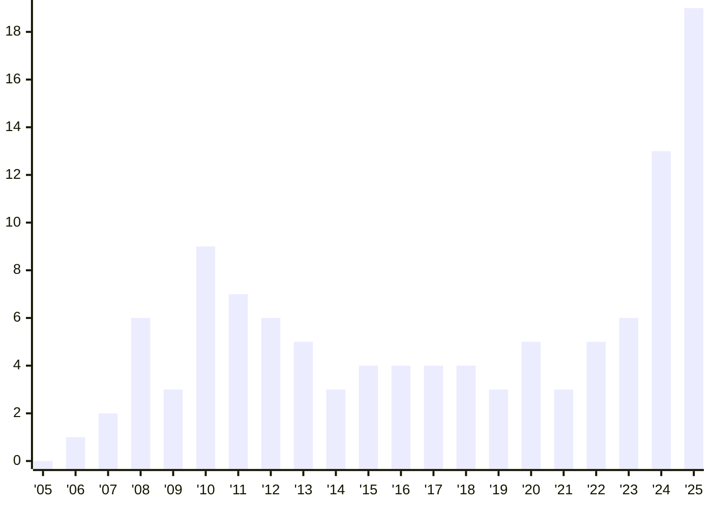
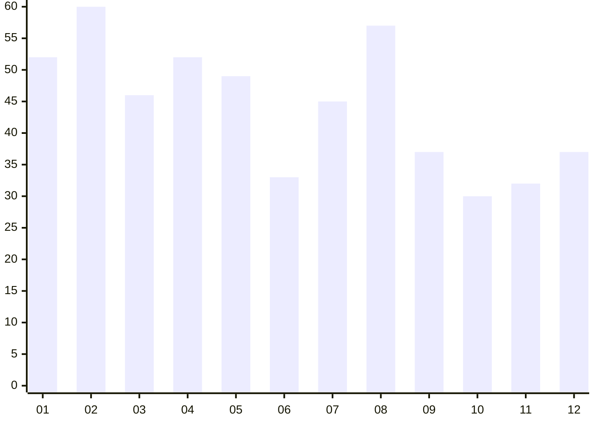
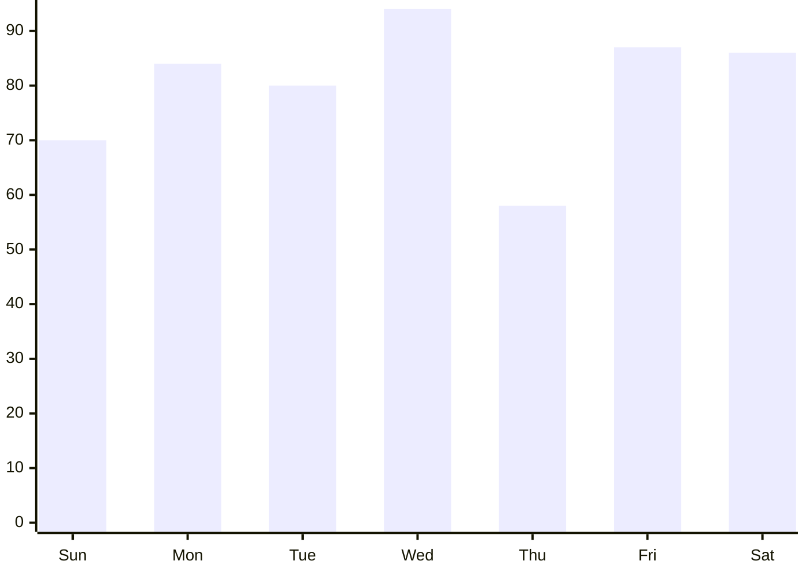

# Статистика

> Редакция от **1 октября 2025** (v1.26.0-n36)

## По годам — всего

На графике показано общее количество существующих (и существовавших ранее) сайтов бордосферы, открытых с 2005 года и по настоящее время.

## По годам — только доступные

На графике показано количество сайтов бордосферы, открытых с 2005 года и доступных по настоящее время.

## По месяцам

На графике показано количество всех сайтов бордосферы, открытых по месяцам.

## По дням недели

На графике показано количество всех сайтов бордосферы, открытых по дням недели.
